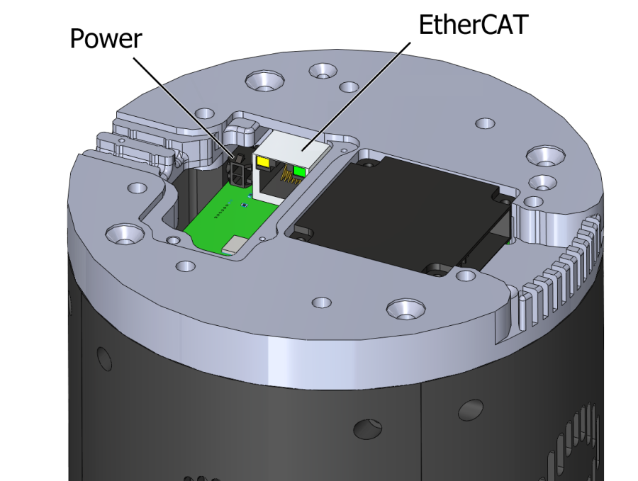

# Setting up the hand

## What's in the box?

```eval_rst
=========================   ===========================================================
Item                        Description
=========================   ===========================================================
Shadow Hand E2M3 or E2PT    Hand Unit
PC                          Host PC control unit for the hand
PSU for Hand                48v for motor hand
Kettle Leads                To connect power supplies to mains
Power Cable                 4-pin Large Lemo connector, already fitted to the hand
EtherCAT Extension Cable    50cm EtherCAT extension lead, already fitted to the Hand
Calibration Jigs            Bag containing calibration jigs for all joints
Toolbox                     Contains hex drivers to perform required maintenance
User Manual                 This document
=========================   ===========================================================
```

## Connecting Cables
There are two ways to connect the EtherCAT and power cables to the hand.

### External connections
If your hand already has cables fitted, then you can simply connect the EtherCAT and power connectors immediately.


**EtherCAT**: Connect the Ethernet cable to the hand's Ethernet socket, and connect the other end to the PC's second
Ethernet port. **If you have a Bi-manual system, connect the Left and Right hands correctly to the labelled ports.** 
You have been supplied with a medium length Ethernet lead, but if you require a longer or shorter one, you can simply use a standard commercial Ethernet Cat 5 cable, available from most computer parts suppliers.

**Power**: Connect the external power supply to the hand using the metal Lemo connector, making sure to line up the red dots. If you require a longer or shorter cable, please contact the Shadow Robot Company.

### Internal connections
If you are connecting the hand to a robot with internal cabling, then you may wish to use the internal connectors.
Turn the hand over, and use the orange and green hex drivers to remove the connector cover. Connect the two cables to their relevant sockets. Now affix the hand to your robot arm. 


## Mounting the hand

Shadow Robot can supply an elbow adaptor plate to adapt the Hand to most other robot arms. However, if you wish to make your own fitting for the Hand: 


The Hand's elbow plate contains eight screw holes which accept M6 bolts to a depth of 12mm. The holes are spaced equally from the centre on a circle wth diameter 100mm. The overall diameter of the elbow plate it 135mm

## Powering up

You can power up the hand and PC in any order. You do not have to power up one before the other. When power is applied to the hand, the fans will be heard immediately.

### Lights

On power up, the lights will be in the following state

```eval_rst
=======================   =============       ================    =================================
Item                      Color               Activity            Meaning
=======================   =============       ================    =================================
Power LEDs                White               On                  Power good
EC Link Active            Green               On                  EtherCAT link established
EC Link Error             Red                 Off                 No EtherCAT link error
Run                       Green               Off                 Hand is in Init state
Application Layer Error   Red                 On (during boot)    Verifying ET1200 EEPROM
Application Layer Error   Red                 Then off            No EtherCAT packet error
ET1200 chip select        Yellow              On                  PIC32 communicating with ET1200
=======================   =============       ================    =================================
```

Lights will also appear inside the motor or muscle base, indicating 5v, 6v and 24v (or
28v)supplies. In the motor hand, these can only be seen by removing the covers.

### Jiggling

This applies to the motor hand only. On reset, all of the strain gauges (torque sensors) in the
motors need to be zeroed. This happens automatically. The motors are driven back and forth
to try to relieve any tension on the tendons. Then both gauges are zeroed. You will therefore
see all joints of the hand move slightly on power up or reset or power up.