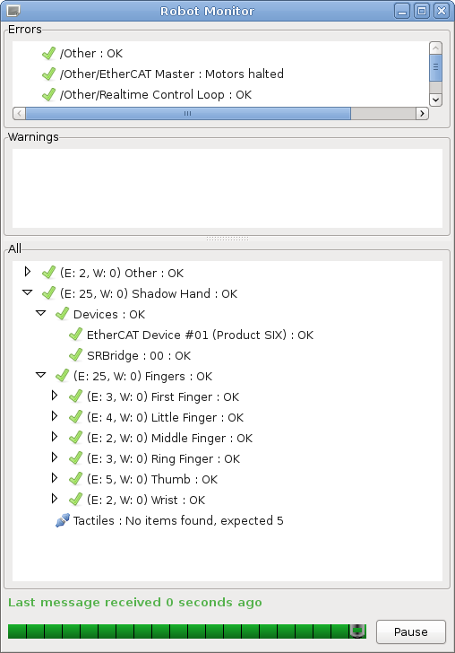
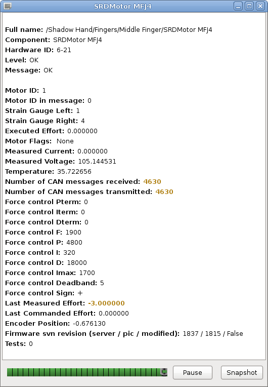
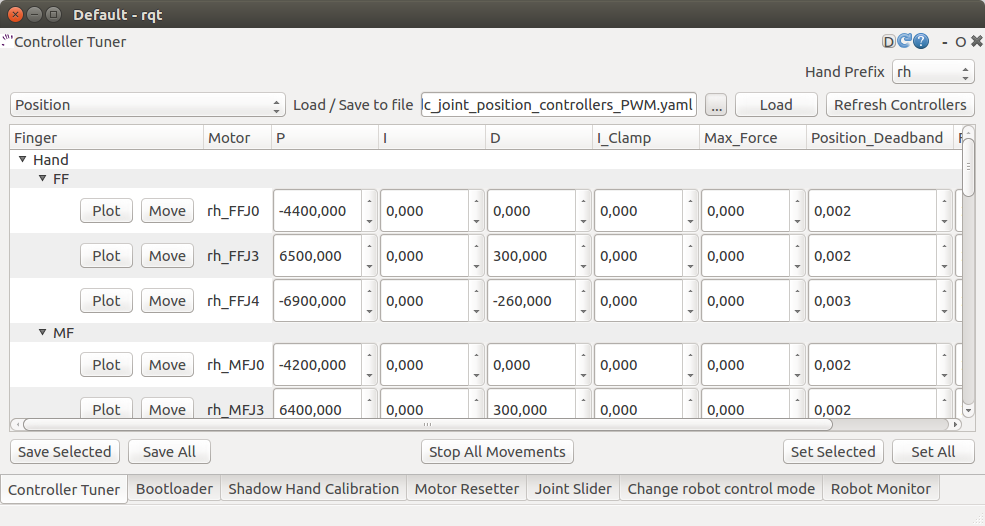
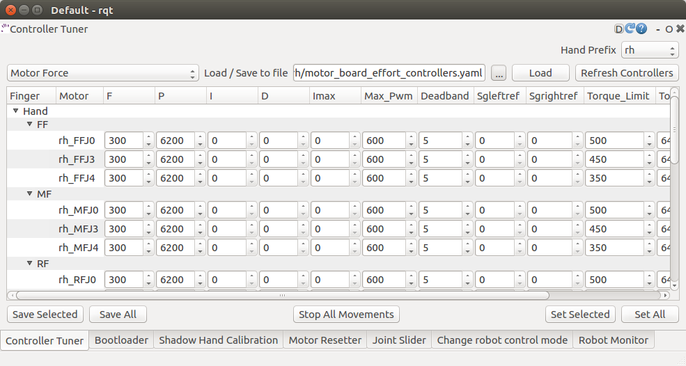
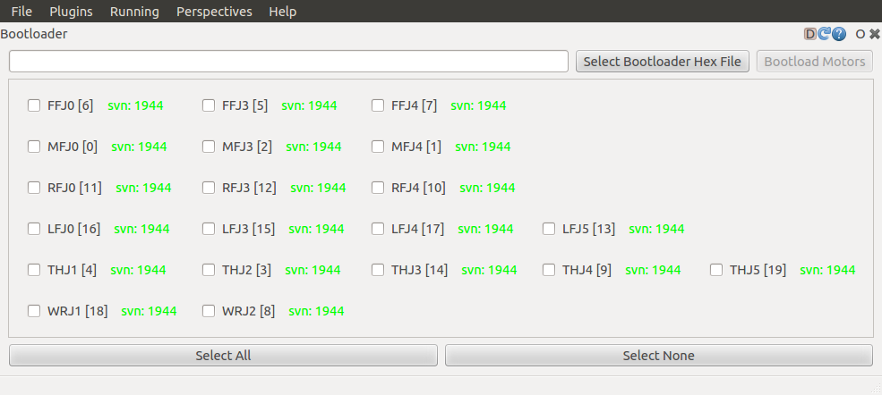
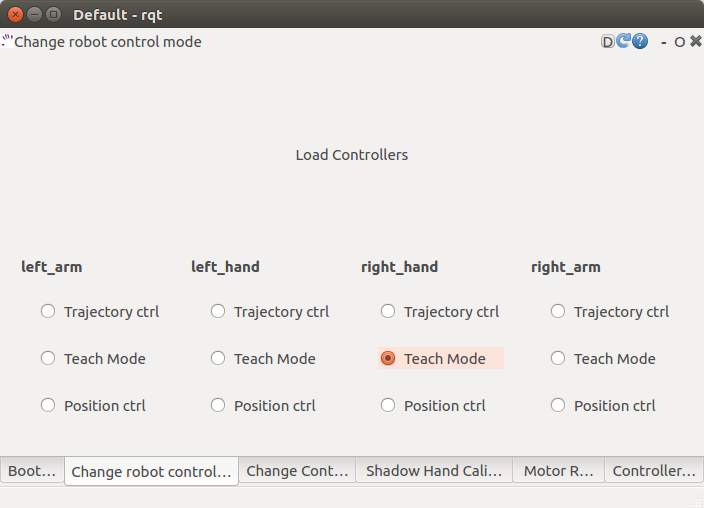
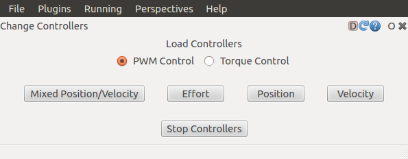
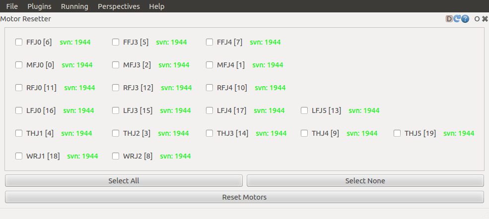
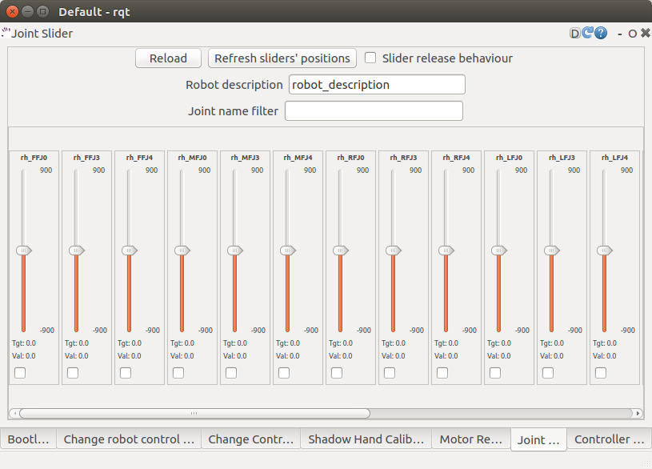
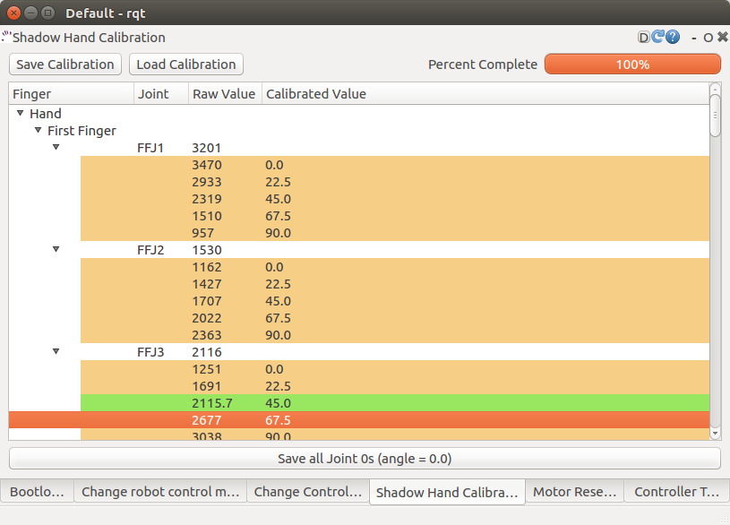

# Getting started

## First time users
If you are unfamiliar with ROS and intend to use the ROS API, it is highly recommended that you read the [ROS Tutorials](http://www.ros.org/wiki/ROS/Tutorials).

If you are unfamiliar with the terminal on Linux, you should look [here](https://askubuntu.com/questions/183775/how-do-i-open-a-terminal).

Shadow software is deployed using Docker. Docker is a container framework where each container image is a lightweight, stand-alone, executable package that includes everything needed to run it. It is similar to a virtual machine but with much less overhead. Follow the instructions in the next section to get the latest Docker container of the hand driver and interface up and running.

## Hardware specifications

In order to run our software and the ROS software stack you will need to meet some hardware requirements.

CPU: Intel i5 or above
RAM: 4GB or above
Hard Drive: Fast HDD or SSD (Laptop HDD are very slow)
Graphics Card: Nvidia GPU (optional)
LAN: A spare LAN port to connect the Hand (even with a USB to LAN adaptor)
OS: Ubuntu 18.04, 16.04 Kinetic (Active development) or 14.04 Indigo for older releases.

The most important one is to have a fast HDD or an SSD.

## Docker
### Installing the software on a new PC using the one-liner
We have created a one-liner that is able to install Docker, download the image and create a new container for you. It will also create two desktop icons, one to start the container and launch the hand and another one to save the log files locally. To use it, you first need to have a PC with Ubuntu installed on it (preferable version 16.04) then follow these steps:

#### Installing for a real robot

* **Check your hand interface ID**:

  Before setting up the docker container, the EtherCAT interface ID for the hand needs to be discovered. In order to do so, after plugging the hand’s ethernet cable into your machine and powering it up, please run

  ```bash
  $ sudo dmesg
  ```
  command in the console. At the bottom, there will be information similar to the one below:

  ```bash
  [490.757853] IPv6: ADDRCONF(NETDEV_CHANGE): enp0s25: link becomes ready
  ```
  In the above example, ‘enp0s25’ is the interface ID that is needed.

* **Get ROS Upload login credentials**

  If you want to upload technical logged data (ROS logs, backtraces, crash dumps etc.) to our server and notify the Shadow's software team to investigate your bug then you need to enable logs uploading in the one-liner. In order to use this option you need to obtain a unique upload key by emailing sysadmin@shadowrobot.com. When you receive the key you can use it when running the one-liner installation tool. To enable the logs uploading you need to add the command line option ```-ck true``` to the one-liner.
  After executing the one-liner, it will prompt you to enter your upload key and press enter to continue. Please copy and paste your key from the email you received by Shadow Robot.

* **Check your hand configuration branch**:

  You should have the name of your [sr_config](https://github.com/shadow-robot/sr-config) hand branch which contains the specific configuration of your hand (calibration, controller tuning etc…).
  Usually it is something like this: ``shadowrobot_XXXXX``.

  If you are unsure please contact us.

* **Run the one-liner**:

  The one-liner will install Docker, pull the image from Docker Hub, and create and run a container with the parameters specified. In order to use it, use the following command:

  **Please remember to replace [EtherCAT interface ID] with your Interface ID and [sr_config_branch] with your unique sr_config branch**

  ROS Kinetic (Recommended):
  ```bash
  $ bash <(curl -Ls http://bit.ly/launch-sh) -i shadowrobot/dexterous-hand:kinetic-release -n dexterous-hand -sn Hand_Launcher -e [EtherCAT interface ID] -b [sr_config_branch]
  ```
  Examples:
  For Interface ID ```ens0s25``` and sr_config_branch ```shadow_12345```
  ```bash
  $ bash <(curl -Ls http://bit.ly/launch-sh) -i shadowrobot/dexterous-hand:kinetic-release -n dexterous-hand -sn Hand_Launcher -e ens0s25 -b shadow_12345
  ```  
  Same as above but with ROS logs upload enabled
  ```bash
  $ bash <(curl -Ls http://bit.ly/launch-sh) -i shadowrobot/dexterous-hand:kinetic-release -n dexterous-hand -sn Hand_Launcher -e ens0s25 -b shadow_12345 -ck true
  ```  

  ROS Indigo:
  ```bash
  $ bash <(curl -Ls http://bit.ly/launch-sh) -i shadowrobot/dexterous-hand:indigo-release -n dexterous-hand -sn Hand_Launcher -e [EtherCAT interface ID] -b [sr_config_branch]
  ```
  Examples:
  For Interface ID ```ens0s25``` and sr_config_branch ```shadow_12345```
  ```bash
  $ bash <(curl -Ls http://bit.ly/launch-sh) -i shadowrobot/dexterous-hand:indigo-release -n dexterous-hand -sn Hand_Launcher -e ens0s25 -b shadow_12345
  ```  
  Same as above but with ROS logs upload enabled
  ```bash
  $ bash <(curl -Ls http://bit.ly/launch-sh) -i shadowrobot/dexterous-hand:indigo-release -n dexterous-hand -sn Hand_Launcher -e ens0s25 -b shadow_12345 -ck true
  ```  

  You can also add -r true in case you want to reinstall the docker image and container. When it finishes it will show:
  ```bash
  Operation completed
  ```
  and it will create two desktop icons on your desktop that you can double-click to launch the hand or save the log files from the active containers to your desktop.
  The icon that launches the hand looks like this:

  

  And for saving the logs:

  

#### Installing for using it in simulation

If you do not actually have a real hand but would like to use our hand in simulation, then please run the following command:

ROS Kinetic (Recommended):
```bash
$ bash <(curl -Ls http://bit.ly/launch-sh) -i shadowrobot/dexterous-hand:kinetic-release -n dexterous-hand -sn Hand_Launcher -b kinetic_devel -l false
```

ROS Indigo:
```bash
$ bash <(curl -Ls http://bit.ly/launch-sh) -i shadowrobot/dexterous-hand:indigo-release -n dexterous-hand -sn Hand_Launcher -b kinetic_devel -l false
```

You can also add -r true in case you want to reinstall the docker image and container. When it finishes it will show:

```bash
Operation completed
```
and it will create two desktop icons on your desktop that you can double-click to launch the hand or save the log files from the active containers to your desktop.

### Using a PC that Shadow provided
In this case, the previous steps would have been performed by the Shadow team before, then the only thing to do to start the Hand is to either double-click the desktop icon or to run the container using:

```bash
$ docker start dexterous-hand
```

You can check the currently available containers using:
```bash
$ docker ps -a
```

The container will be ready when fingers move to the zero position.

## Saving log files and uploading data to our server
When running the one-liner, along with the icon that starts the Grasper, you will also notice a second icon named Save logs that is used to retrieve and copy all the available logs files from the active containers locally on your Desktop. This icon will create a folder that matches the active container's name and the next level will include the date and timestamp it was executed. When it starts, it will prompt you if you want to continue, as by pressing yes it will close all active containers. If typed 'y' to continue, you will have to enter a description of the logging event and will start coping the bag files, logs and configuration files from the container and then exit. Otherwise, the window will close and no further action will happen. If you provided an upload key with the one-liner installation then the script will also upload your LOGS in compressed format to our server and notify the Shadow's software team about the upload. This will allow the team to fully investigate your issue and provide support where needed.

## Starting the driver (Real hand)

### Shadow Hand Driver
  Launch the driver for the Shadow Hand using the desktop icon 'Hand_Launcher' or at a
  terminal (in the container), type:

  ```bash
  $ sudo -s
  $ roslaunch sr_ethercat_hand_config sr_rhand.launch
  ```

  **Warning**: This terminal now has root privileges, and the system is giving you
  permission to do things which can mess up the configuration of the PC. Do not run any
  other commands in this terminal window. Only use this terminal to launch the driver.

### Lights in the hand:
  When the ROS driver is running you should see the following lights on the Palm:

  ```eval_rst
  ========================   =============       ================    =================================
  Light                      Colour              Activity            Meaning
  ========================   =============       ================    =================================
  Run                        Green               On                  Hand is in Operational state
  CAN1/2 Transmit            Blue                V.fast flicker      Demand values are being sent to the motors
  CAN1/2 Receive             Blue                V.fast flicker      Motors are sending sensor data
  Joint sensor chip select   Yellow              On                  Sensors being sampled
  ========================   =============       ================    =================================
  ```

  After killing the driver, the lights will be in a new state:
  ```eval_rst
  ========================   =============       ================    =================================
  Light                      Colour              Activity            Meaning
  ========================   =============       ================    =================================
  Run                        Green               Blinking            Hand is in Pre-Operational state
  CAN1/2 Transmit            Blue                Off                 No messages transmitted on CAN 1/2
  CAN1/2 Receive             Blue                Off                 No messages received on CAN 1/2
  Joint sensor chip select   Yellow              Off                 Sensors not being sampled
  ========================   =============       ================    =================================
  ```

## Graphical User Interface

The majority of functionality is provided by the software Application Programmer Interface (API). However, a few simple functions are provided in the Graphical User Interface (GUI) to test the hand, validate that it is working correctly, and adjust some of its settings.

### Starting the interface
You may open the Graphical User Interface to try out some functions of the hand. From the Docker terminal, type:
```bash
$ rqt
```

  This interface contains a number of plugins for interacting with the EtherCAT hand. Most of them are available from the **Plugins → Shadow Robot** menu.

### Robot Monitor
We can check that everything on the robot is working correctly using the Diagnostic Viewer.

  **Plugins → Robot Tools → Diagnotic Viewer**

  


This brings up a dialog box containing a tree of all parts of the robot. All parts should be marked with a green tick.

You can examine one motor in detail by double-clicking on it. This brings up the Motor Monitor dialog. This window can be used to check the status of a motor, or debug any problems.



The following table has some more information on what each of these fields mean.

```eval_rst
============================   ==============================================================================================
Item                           Description
============================   ==============================================================================================
Full Name
Component
Hardware ID
Level
Message                        Any error or status messages
Motor ID                       This is the motor number. Range [0..19]
Motor ID in message            For debugging only
Strain Gauge Left / Right      These are the ADC readings from the two gauges
Executed Effort
Motor Flags                    See motor flags table below
Measured current               Current flowing through the motor (Amps)
Measured Voltage               The motor power supply voltage. Not the voltage at the motor
Temperature                    The temperature measured near the motor. The actual motor winding temperature will be higher than this. (ºC)
Number of CAN messages         Received messages should be twice the transmitted messages
Force control P, I, D terms    These are the PID terms from inside the motor's torque controller. They may be useful for debugging if plotted.
Force control F, P, I, D,
Imax, Deadband, Sign           These are the FPID gain settings used by the motor's torque controller. They can be changed using the controller tuner.
Last Measured Effort           Difference between the two gauge readings (Torque)
Last Commanded Effort          Torque requested by the host-side control algorithms
Encoder Position               The angle of the joint in radians (ROS always calls this Encoder position, even if the robot uses Hall effect sensors)
Firmware svn revision          xxxx: The latest version of the firmware available at build time
                               xxxx: The version of the firmware in the motor MCU
                               False: There are no un-checked-in modifications to this firmware. This should never be true.
============================   ==============================================================================================
```

```eval_rst
+------------------------------------------------+-------------------------------------------------------------------------------------------------------------------------+
|                   Full Name                    |                                                       Description                                                       |
+================================================+=========================================================================================================================+
| Component                                      |                                                                                                                         |
+------------------------------------------------+-------------------------------------------------------------------------------------------------------------------------+
| Hardware ID                                    |                                                                                                                         |
+------------------------------------------------+-------------------------------------------------------------------------------------------------------------------------+
| Level                                          |                                                                                                                         |
+------------------------------------------------+-------------------------------------------------------------------------------------------------------------------------+
| Message                                        | Any error or status messages                                                                                            |
+------------------------------------------------+-------------------------------------------------------------------------------------------------------------------------+
| Motor ID                                       | This is the motor number. Range [0..19]                                                                                 |
+------------------------------------------------+-------------------------------------------------------------------------------------------------------------------------+
| Motor ID in message                            | For debugging only                                                                                                      |
+------------------------------------------------+-------------------------------------------------------------------------------------------------------------------------+
| Strain Gauge Left / Right                      | These are the ADC readings from the two gauges                                                                          |
+------------------------------------------------+-------------------------------------------------------------------------------------------------------------------------+
| Executed Effort                                |                                                                                                                         |
+------------------------------------------------+-------------------------------------------------------------------------------------------------------------------------+
| Motor Flags                                    | See motor flags table below                                                                                             |
+------------------------------------------------+-------------------------------------------------------------------------------------------------------------------------+
| Measured current                               | Current flowing through the motor (Amps)                                                                                |
+------------------------------------------------+-------------------------------------------------------------------------------------------------------------------------+
| Measured Voltage                               | The motor power supply voltage. Not the voltage at the motor                                                            |
+------------------------------------------------+-------------------------------------------------------------------------------------------------------------------------+
| Temperature                                    | The temperature measured near the motor. The actual motor winding temperature will be higher than this. (ºC)            |
+------------------------------------------------+-------------------------------------------------------------------------------------------------------------------------+
| Number of CAN messages                         | Received messages should be twice the transmitted messages                                                              |
+------------------------------------------------+-------------------------------------------------------------------------------------------------------------------------+
| Force control P, I, D terms                    | These are the PID terms from inside the motor's torque controller. They may be useful for debugging if plotted.         |
+------------------------------------------------+-------------------------------------------------------------------------------------------------------------------------+
| Force control F, P, I, D, Imax, Deadband, Sign | These are the FPID gain settings used by the motor's torque controller. They can be changed using the controller tuner. |
+------------------------------------------------+-------------------------------------------------------------------------------------------------------------------------+
| Last Measured Effort                           | Difference between the two gauge readings (Torque)                                                                      |
+------------------------------------------------+-------------------------------------------------------------------------------------------------------------------------+
| Last Commanded Effort                          | Torque requested by the host-side control algorithms                                                                    |
+------------------------------------------------+-------------------------------------------------------------------------------------------------------------------------+
| Encoder Position                               | The angle of the joint in radians (ROS always calls this Encoder position, even if the robot uses Hall effect sensors)  |
+------------------------------------------------+-------------------------------------------------------------------------------------------------------------------------+
| Firmware svn revision                          | xxxx: The latest version of the firmware available at build time                                                        |
+------------------------------------------------+-------------------------------------------------------------------------------------------------------------------------+
|                                                | xxxx: The version of the firmware in the motor MCU                                                                      |
+------------------------------------------------+-------------------------------------------------------------------------------------------------------------------------+
|                                                | False: There are no un-checked-in modifications to this firmware. This should never be true.                            |
+------------------------------------------------+-------------------------------------------------------------------------------------------------------------------------+
```


### Controller tuner
It is possible to adjust the settings for any of the Position or Force (Motor) controllers.
	**Plugins → Shadow Robot → Basic → Controller Tuner**
#### Position controller
  


  Here you can select a finger, thumb or wrist joints, and adjust the different position control parameters. Click ```Set Selected``` to send the new values to the motors and make them take effect.

* **“P”, “I” & “D” terms:**  Gains parameter of the position PID controller. By default, Shadow tunes the paramenters using P or PD combinations. The user can add “I” gains in the control if he considers necessary.

* **Max_force:** This puts a limit on the output (PWM) value that will be sent from the host to the motor by the position controller. It can be useful when setting up a controller for the first time to limit the motor power to a safe level.

* **Position_Deadband:** The error is considered to be zero if it is within ±deadband. This value should be set as a little more than the noise on the sensor. The units of deadband are the same as the value being controlled. So, the deadband for a position controller is in radians.

#### Force controller


* **“P”, “I” & “D” terms:** Gains parameter of the torque PID controller. By default, Shadow tunes the paramenters using just P gain for the torque control.

* **Max_PWM:** This puts a limit on the final PMW value that will be sent to the motor by the torque controller. It can be useful when setting up a controller for the first time to limit the motor power to a safe level.

* **Deadband:** The error is considered to be zero if it is within ±deadband. This value should be set as a little more than the noise on the sensor. The units of deadband are the same as the value being controlled. The deadband for a torgue controller is in the units of the strain gauges.

* **Torque_Limit:** This value is used to limit the PWM at the end of the control loop. The control algoritm reduces the final PWM that goes to the motor making sure that the force in the strain gauge doesn’t overcome this limit value.

Click ```Save``` to save your settings.

### Bootloader
The firmware in the motors MCUs can be updated from the PC, without opening up the motor base. This can be done from the GUI. Shadow will send you a new HEX if there is an update.
	**Plugins → Shadow Robot → Advanced → Motor Bootloader**

You will see a window listing each motor board, along with its current firmware SVN revision number.



* **Select Bootloader Hex File:** Next, tell the plugin which firmware to use. The file you should choose here is the one sent by Shadow.

* **Select your motors:** Now you may choose which motors to program. Either select one or more motors using the tick boxes, or click the ```Select All``` or ```Deselect All``` button.

* **Program Motors:** Now you can click the ```Bootload Motors``` button. The process is fairly slow, and takes about a 30 second per motor.

### Change controllers
Use the *Change Controllers* plugin to load one of the three different types of controllers set by default. Simply click on a controller type, and it will call a service from the pr2_controller_manager to unload the currently running controller if necessary, and load the one you've selected. See the chapter on control for details of these algorithms.
	**Plugins → Shadow Robot → Change Controllers**



### Advanced controllers
Apart from the three standard controls, you can set the parameters for different control strategies (host – motor) from this plugin.
	**Plugins → Shadow Robot → Advanced → Advanced Controls**

  

  **NOTE: CURRENTLY THE ONLY FULLY SUPPORTED TYPES ARE POSITION - PWM CONTROL** *(position control),* **AND EFFORT - TORQUE CONTROL** *(teach mode control).* **SELECTING OTHER TYPES MAY CAUSE UNPREDICTABLE RESULTS AND DAMAGE THE HARDWARE.**

  ### Motor Resetter
If for some reason you need to reset the firmware on a motor, you can either press the reset button on the PCB itself (which requires removal of the base covers), or use this plugin.
	**Plugins → Shadow Robot → Basic → Motor Resetter**

  

  Tick the motors you wish to reset, and click ```Reset Motors```. You should see the corresponding joints jiggle as the motors auto-zero the strain gauges.

### Joint Sliders
A simple interface has been provided to control the position of each joint using a slider (you have to start the position control first).
	**Plugins → Shadow Robot → Joint Sliders**
    


  A window with twenty sliders will appear. Moving any slider will cause the corresponding joint on the hand to move.

### Hand Calibration
This plugin is used internally by Shadow to calibrate the raw data from the position sensors.
	**Plugins → Shadow Robot → Basic → Shadow Hand Calibration**

  

  It’s very unlikely that the sensors moved inside of the hand, BUT, if you find misalligments with the model and you require a re-calibration, contact Shadow Robot Company here: <support@shadowrobot.es>.


## Command line interface
All functions of the hand are available from the command line.
### Using rostopic

You can find all the information about the topic published in the Shadow Hand from this link:

<https://shadowrobot.atlassian.net/wiki/spaces/HANDEG/pages/63569986/Hand+E+ROS+Kinetic+Topics>


### Using rosservice
To reset individual motors, E.G. FFJ3:
  ```bash
	$ rosservice call /realtime_loop/reset_motor_FFJ3
  ```
To change control modes, E.G. teach mode:
  ```bash
	$ rosservice call /realtime_loop/xxxxxx
  ```

## Writing controllers
Rather than use the ROS topics to access sensor data, you will need to write a plugin for the PR2 Controller Manager. This will give you access to the sensor data at the full 1kHz rate, and allow you to create your own control algorithms for the hand. Please see this page for more information about the PR2 Controller Manager:
	<http://ros.org/wiki/pr2_controller_manager>

The Controller Manager is the node that talks to the hardware via EtherCAT and provides a facility for hosting plugins. The position controllers you have already used are examples of this. Note that the Controller Manager can host any number of running controllers but one should be loaded at a time for a given joint so they don't fight for control.

## Deeper settings
### Editing PID settings
The motor controller PID settings are stored in a YAML files. You can find the files in the next folder:
  ```bash
	$ roscd sr_ethercat_hand_config/controls/
  ```
###  Changing motor data update rates
Each motor can return two sensor readings every 2ms. The first is always the measured torque. The second is requested by the host. This allows the host to decide on the sensor update rate of each sensor. Currently, the rates cannot be adjusted at run-time, and are specified in a file which you can edit. To edit the file:
  ```bash
  $ roscd sr_robot_lib/config
  $ gedit motor_data_polling.yaml
  ```

The complete list of motor sensors appears in the file, along with a number
```eval_rst
=======     ===========================
Number      Meaning
=======     ===========================
-2          Read once when the driver is launched
-1          Read as fast as possible
 0          Do not use zero
>0          Read period in seconds
=======     ===========================
```

Sensors set to -1 will be read in turn, unless it's time to read another sensor. Usually 5 sensors are set to -1, meaning that they are sampled at 100Hz.
